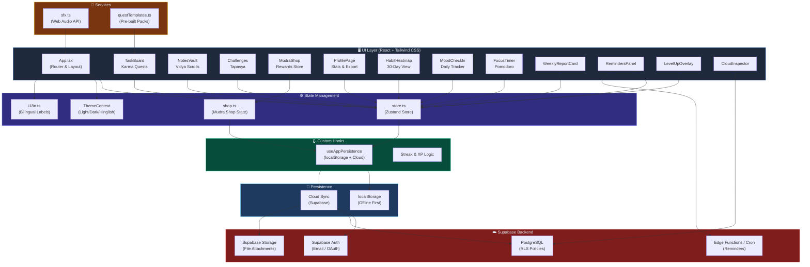
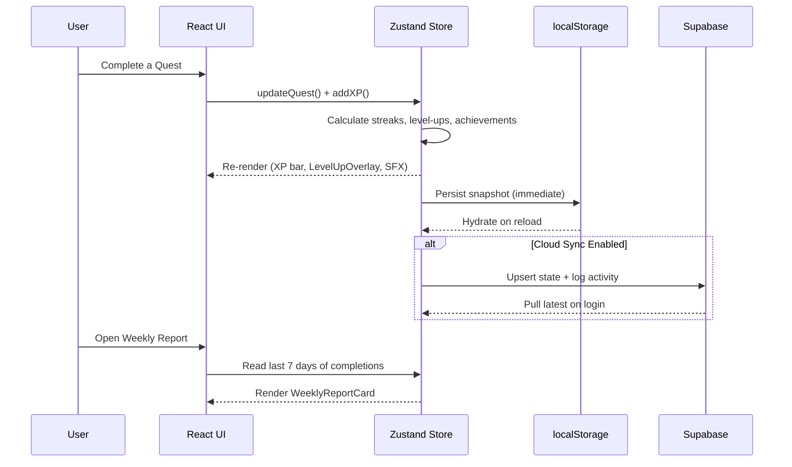
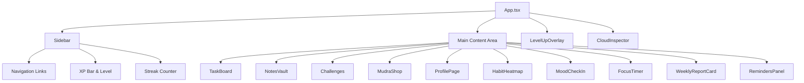

# KarmQuest — Architecture Diagram

```mermaid
graph TB
    subgraph UI["🖥️ UI Layer (React + Tailwind CSS)"]
        App["App.tsx<br/>(Router & Layout)"]
        TaskBoard["TaskBoard<br/>Karma Quests"]
        NotesVault["NotesVault<br/>Vidya Scrolls"]
        Challenges["Challenges<br/>Tapasya"]
        Shop["MudraShop<br/>Rewards Store"]
        Profile["ProfilePage<br/>Stats & Export"]
        Heatmap["HabitHeatmap<br/>30-Day View"]
        Mood["MoodCheckIn<br/>Daily Tracker"]
        FocusTimer["FocusTimer<br/>Pomodoro"]
        WeeklyReport["WeeklyReportCard"]
        Reminders["RemindersPanel"]
        LevelUp["LevelUpOverlay"]
        CloudInspector["CloudInspector"]
    end

    subgraph State["⚙️ State Management"]
        Store["store.ts<br/>(Zustand Store)"]
        ShopStore["shop.ts<br/>(Mudra Shop State)"]
        ThemeCtx["ThemeContext<br/>(Light/Dark/Hinglish)"]
        I18n["i18n.ts<br/>(Bilingual Labels)"]
    end

    subgraph Hooks["🪝 Custom Hooks"]
        Persist["useAppPersistence<br/>(localStorage + Cloud)"]
        Streaks["Streak & XP Logic"]
    end

    subgraph Services["🔧 Services"]
        SFX["sfx.ts<br/>(Web Audio API)"]
        Templates["questTemplates.ts<br/>(Pre-built Packs)"]
    end

    subgraph Backend["☁️ Supabase Backend"]
        Auth["Supabase Auth<br/>(Email / OAuth)"]
        DB["PostgreSQL<br/>(RLS Policies)"]
        Storage["Supabase Storage<br/>(File Attachments)"]
        Cron["Edge Functions / Cron<br/>(Reminders)"]
    end

    subgraph Persistence["💾 Persistence"]
        LocalStorage["localStorage<br/>(Offline First)"]
        CloudSync["Cloud Sync<br/>(Supabase)"]
    end

    %% UI → State
    App --> Store
    App --> ThemeCtx
    App --> I18n
    TaskBoard --> Store
    NotesVault --> Store
    Challenges --> Store
    Shop --> ShopStore
    Profile --> Store
    Heatmap --> Store
    Mood --> Store
    FocusTimer --> Store
    WeeklyReport --> Store
    Reminders --> Store
    LevelUp --> Store

    %% State → Hooks
    Store --> Persist
    ShopStore --> Persist

    %% Hooks → Persistence
    Persist --> LocalStorage
    Persist --> CloudSync

    %% Cloud Sync → Backend
    CloudSync --> Auth
    CloudSync --> DB
    CloudSync --> Storage
    Reminders --> Cron

    %% Services → UI
    SFX --> App
    Templates --> TaskBoard

    %% Inspector
    CloudInspector --> DB

    %% Styling
    style UI fill:#1e293b,stroke:#60a5fa,color:#e2e8f0
    style State fill:#312e81,stroke:#818cf8,color:#e2e8f0
    style Hooks fill:#064e3b,stroke:#34d399,color:#e2e8f0
    style Services fill:#78350f,stroke:#fbbf24,color:#e2e8f0
    style Backend fill:#7f1d1d,stroke:#f87171,color:#e2e8f0
    style Persistence fill:#1e3a5f,stroke:#38bdf8,color:#e2e8f0
```

## Data Flow Summary

```mermaid
sequenceDiagram
    participant User
    participant UI as React UI
    participant Store as Zustand Store
    participant LS as localStorage
    participant Cloud as Supabase

    User->>UI: Complete a Quest
    UI->>Store: updateQuest() + addXP()
    Store->>Store: Calculate streaks, level-ups, achievements
    Store-->>UI: Re-render (XP bar, LevelUpOverlay, SFX)
    Store->>LS: Persist snapshot (immediate)
    LS-->>Store: Hydrate on reload

    alt Cloud Sync Enabled
        Store->>Cloud: Upsert state + log activity
        Cloud-->>Store: Pull latest on login
    end

    User->>UI: Open Weekly Report
    UI->>Store: Read last 7 days of completions
    Store-->>UI: Render WeeklyReportCard
```

## Component Tree (Simplified)

```mermaid
graph TD
    A["App.tsx"] --> B["Sidebar"]
    A --> C["Main Content Area"]
    C --> D["TaskBoard"]
    C --> E["NotesVault"]
    C --> F["Challenges"]
    C --> G["MudraShop"]
    C --> H["ProfilePage"]
    C --> I["HabitHeatmap"]
    C --> J["MoodCheckIn"]
    C --> K["FocusTimer"]
    C --> L["WeeklyReportCard"]
    C --> M["RemindersPanel"]
    A --> N["LevelUpOverlay"]
    A --> O["CloudInspector"]
    B --> P["Navigation Links"]
    B --> Q["XP Bar & Level"]
    B --> R["Streak Counter"]
```